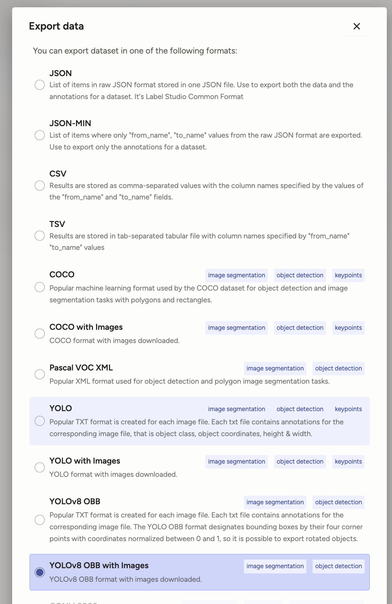
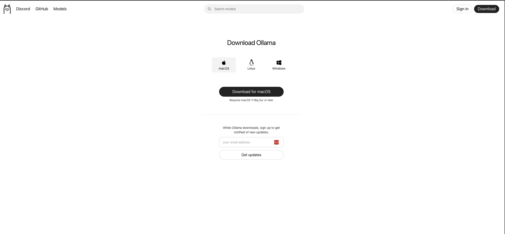

# Hackaton - IA para DEVS

Neste projeto, foram utilizadas as seguintes tecnologias:

- **YOLO**: Framework de visão computacional para detecção de objetos em imagens.
- **Label Studio**: Plataforma de código aberto para rotulagem e anotação de dados, utilizada para classificar imagens.
- **Llama**: Modelo de linguagem de última geração para tarefas de processamento de linguagem natural.
- **Streamlit**: Framework para criação rápida de aplicações web interativas em Python, facilitando a visualização e interação com os resultados.


## Como instalar as dependencias
```
python -m venv ./venv
source venv/bin/activate
pip install -r requirements.txt
```

## Como rotular imagens com o Label Studio

Para iniciar o Label Studio e rotular suas imagens, execute:

```bash
label-studio
```

Após rotular, baixe as anotações no formato YOLO conforme mostrado na imagem abaixo:



> **Observação:** Após baixar as anotações no formato YOLO, renomeie a pasta exportada para `YOLO` para padronizar o nome do diretório utilizado nos próximos passos.

## Crie o arquivo dataset.yaml

Após exportar as anotações no formato YOLO pelo Label Studio, será gerada uma pasta contendo as imagens e os arquivos de anotação. Para treinar o YOLO, é necessário criar um arquivo `dataset.yaml` apontando para essas pastas.

Exemplo de estrutura de diretórios exportada:
```
yolo/
├── images/
│   ├── image1.jpg
│   └── image2.jpg
└── labels/
    ├── image1.txt
    └── image2.txt
```

Exemplo de conteúdo do `dataset.yaml`:
```yaml
train: yolo/images
val: yolo/images

nc: 2  # número de classes
names: ['classe1', 'classe2']  # substitua pelos nomes reais das classes
```

- Altere os caminhos de `train` e `val` para o diretório das imagens exportadas.
- Atualize `nc` com o número de classes do seu projeto.
- Substitua os nomes em `names` pelas classes utilizadas na anotação.

Salve o arquivo como `dataset.yaml` na raiz do seu projeto ou em um local de fácil acesso para o comando de treinamento do YOLO.


## Treine o modelo do YOLO após criar o arquivo dataset.yaml
```
yolo detect train data=dataset.yaml model=yolov8m.pt epochs=100 imgsz=800 batch=16 patience=20
```
> **Observação:** Os parâmetros e o modelo utilizados no treinamento devem ser escolhidos pelo usuário conforme as necessidades e características específicas de cada projeto.


## Teste o modelo criado para validar se ele esta rotulando as imagens corretamente
```
yolo detect predict model=runs/detect/train2/weights/best.pt source=yolo/images save=True
```

Você pode visualizar as imagens de teste processadas pelo modelo na pasta [`runs/detect/predict`](./runs/detect/predict). Nessa pasta, estarão disponíveis as imagens originais com as detecções realizadas pelo modelo treinado, facilitando a validação visual dos resultados.

> **Observação:** Será gerada uma pasta `predict` contendo as imagens processadas a partir do diretório especificado em `source`. Essas imagens estarão rotuladas conforme o modelo treinado, permitindo a validação dos resultados.

## Instale o Ollama
1. Baixe o servidor Ollama no site oficial: [https://ollama.com/download](https://ollama.com/download)

    

2. Após instalar o Ollama, faça o download do modelo Llama 3.2 executando o comando abaixo no terminal:

    ```bash
    ollama run llama3.2
    ```

> **Observação:** Certifique-se de que o Ollama está em execução antes de baixar e utilizar o modelo. Consulte a documentação oficial para mais detalhes sobre configuração e uso de modelos adicionais.

## Como executar o projeto

Para iniciar a aplicação, certifique-se de que todas as dependências estão instaladas e o ambiente virtual está ativado. Em seguida, execute o comando abaixo para rodar a interface web:

```bash
streamlit run application.py
```

O Streamlit abrirá automaticamente uma nova aba no seu navegador padrão com a interface do projeto. Caso isso não ocorra, acesse manualmente o endereço exibido no terminal (geralmente `http://localhost:8501`).

> **Dica:** Se precisar interromper a aplicação, pressione `Ctrl+C` no terminal.